# 🍎 FruitHub - E-Commerce Flutter App

A modern, feature-rich e-commerce mobile application built with Flutter for selling fresh fruits and seasonal produce. The app provides a seamless shopping experience with bilingual support (Arabic/English) and integrated payment solutions.

## 📱 Screenshots

<p align="center">
  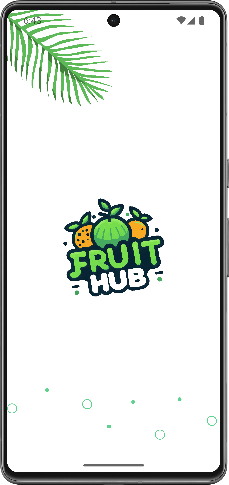
  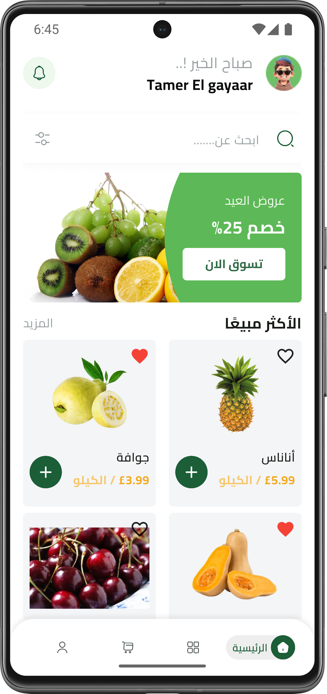
  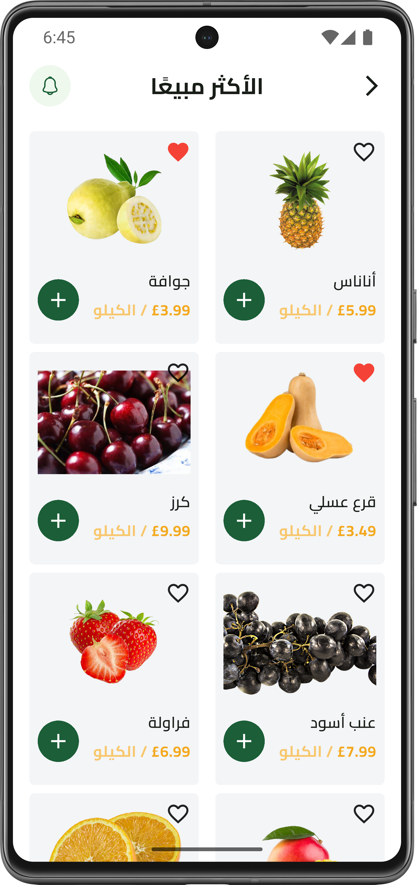
  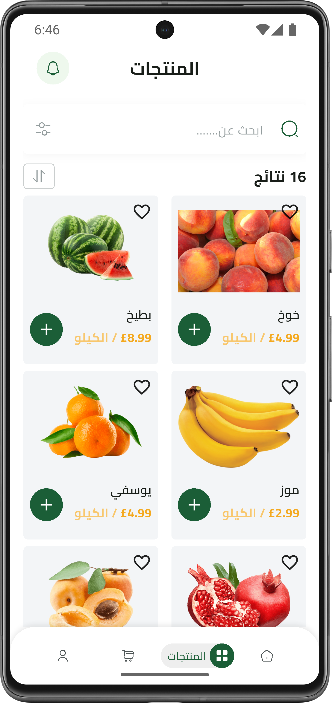
  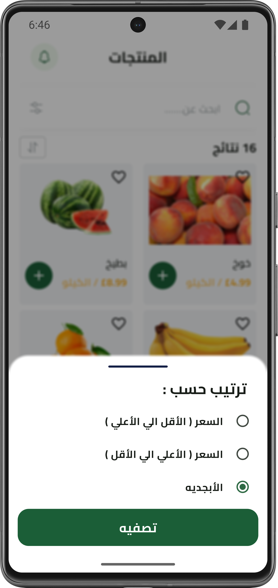
</p>

<p align="center">
  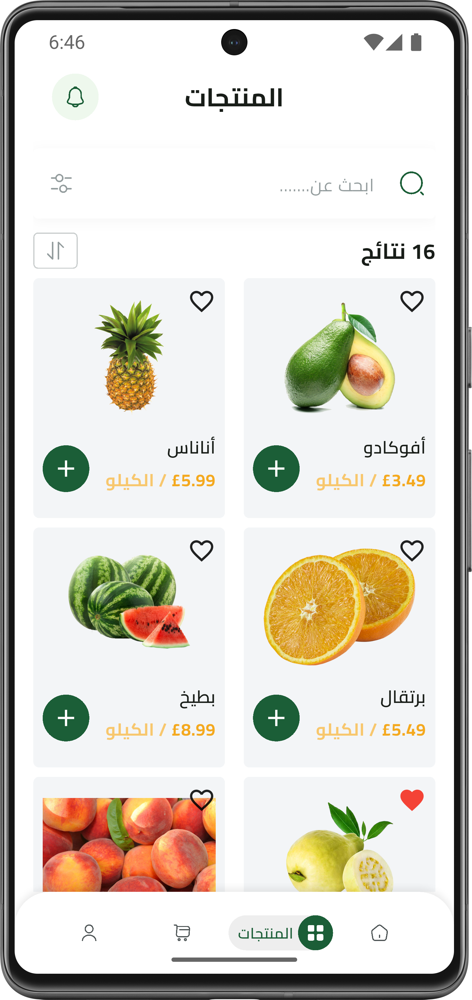
  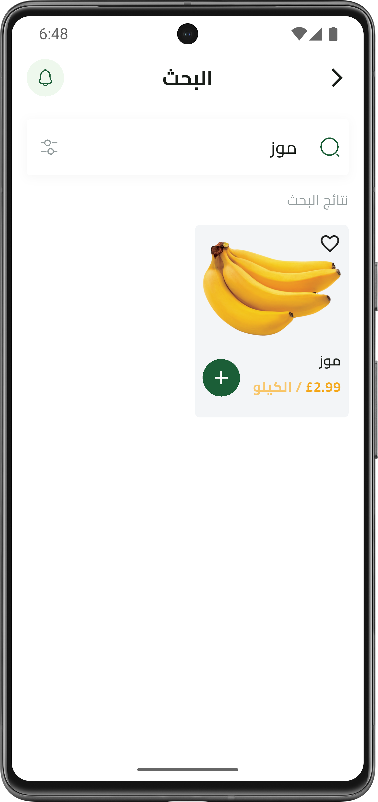
  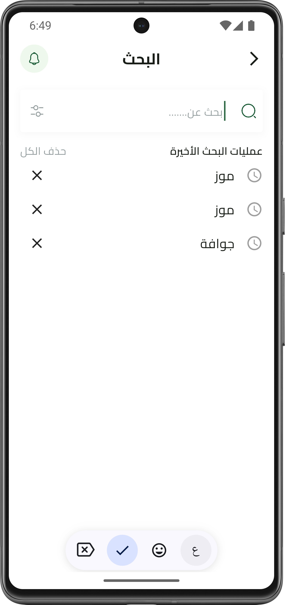
  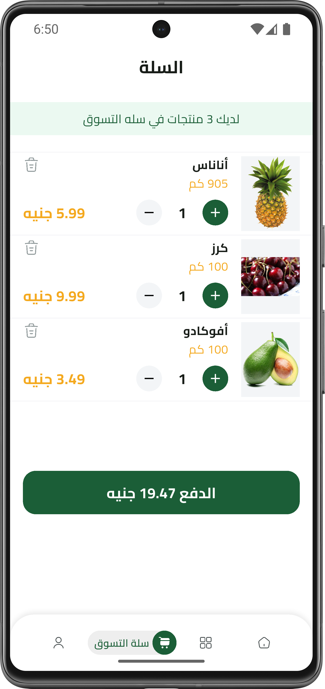
  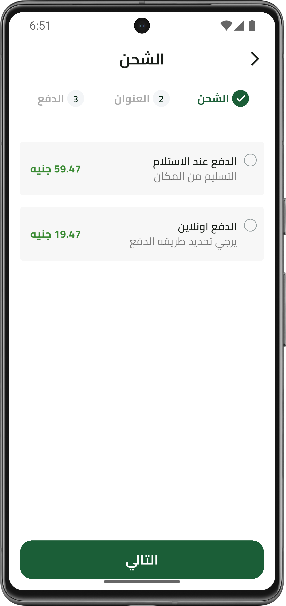
</p>

<p align="center">
    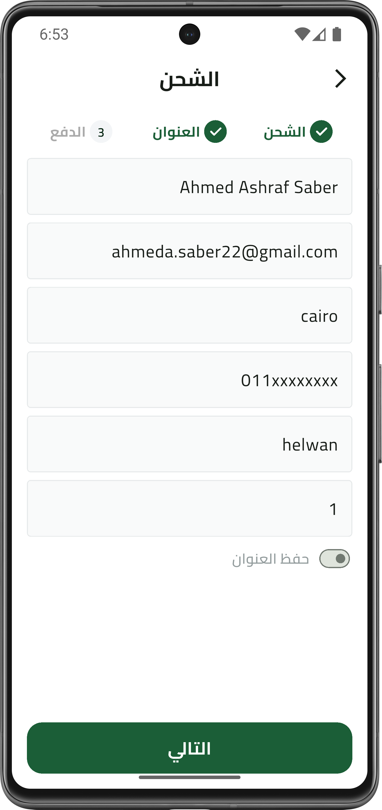
    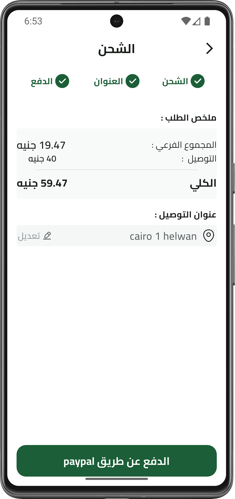
    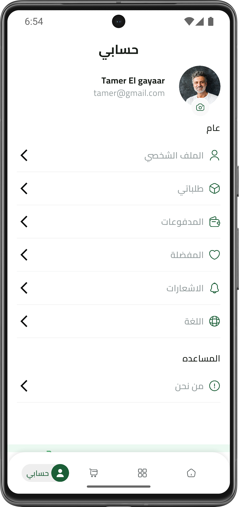
    
    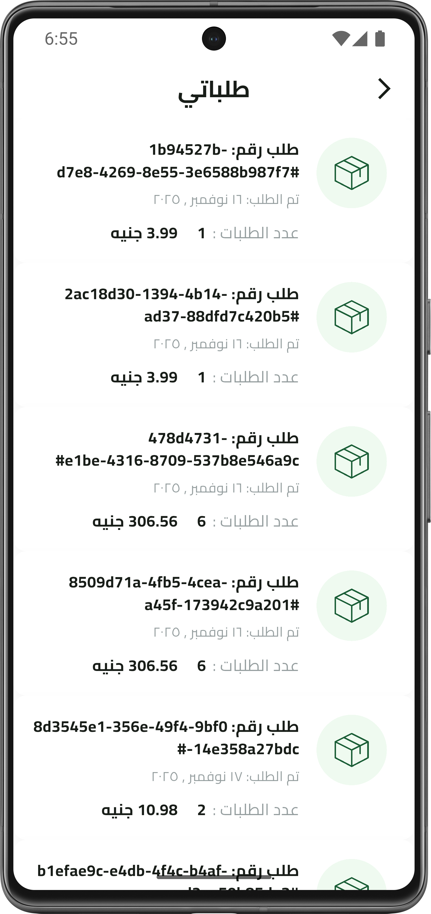
</p>


<p align="center">
  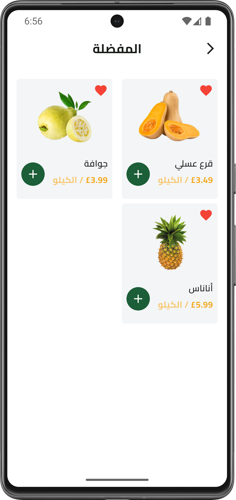
  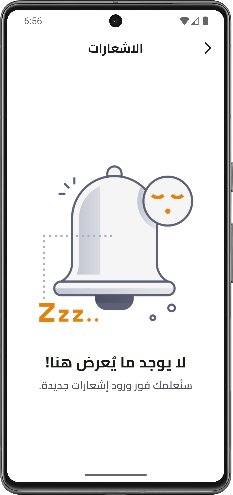
  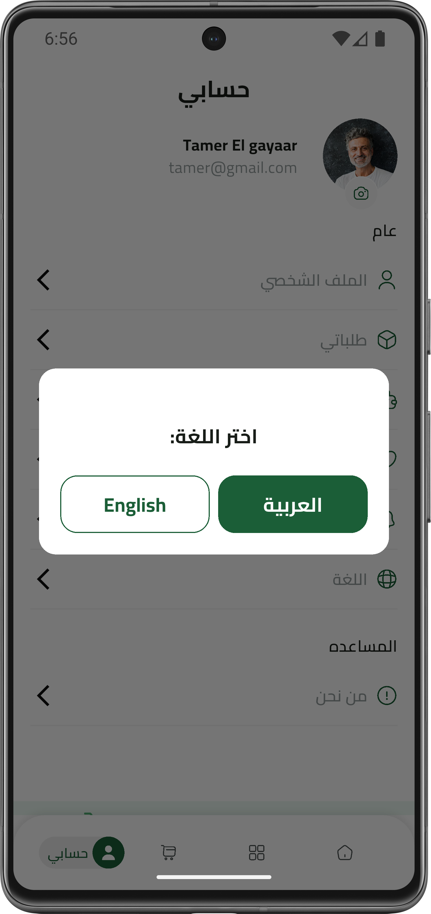
  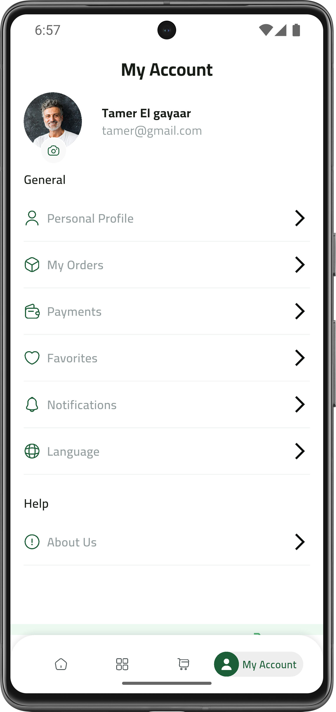
</p>

## ✨ Features

### 🛍️ Shopping Features
- Browse fresh fruits with high-quality images
- Best-selling products section
- Advanced search with history
- Filter & sort products (price, alphabetical)
- Product details with reviews and ratings
- Shopping cart with quantity management
- Favorites/Wishlist functionality

### 💳 Payment & Checkout
- Cash on delivery
- Online payment via PayPal integration
- Secure checkout process
- Order tracking
- Order history

### 👤 User Management
- Email/Password authentication
- Google Sign-In
- Facebook Sign-In
- Password reset functionality
- Personal profile management
- Change password feature

### 🌐 Localization
- Full bilingual support (Arabic/English)
- RTL support for Arabic
- Dynamic language switching
- Localized content and dates

### 📊 State Management
- BLoC pattern implementation
- Hydrated BLoC for persistent state
- Cubit for simpler state management

### 💾 Data Persistence
- Firebase Firestore for backend
- Hive for local caching
- SharedPreferences for user settings
- Favorites stored locally

## 🏗️ Architecture

The app follows **Clean Architecture** principles with clear separation of concerns:

```
lib/
├── core/                    # Core functionality
│   ├── entities/           # Business entities
│   ├── models/             # Data models
│   ├── repos/              # Repository interfaces & implementations
│   ├── services/           # App services (Firebase, Storage, etc.)
│   ├── utils/              # Utilities and helpers
│   └── widgets/            # Reusable widgets
├── features/               # Feature modules
│   ├── authentication/     # Auth features
│   ├── home/              # Home & main features
│   ├── checkout/          # Payment & checkout
│   ├── favorites/         # Favorites management
│   ├── search/            # Search functionality
│   └── ...                # Other features
└── generated/             # Generated localization files
```

## 🛠️ Technologies & Packages

### Core
- **Flutter SDK**: Cross-platform development
- **Dart**: Programming language

### State Management
- `flutter_bloc` / `bloc`: State management
- `hydrated_bloc`: Persistent state
- `equatable`: Value equality

### Backend & Database
- `firebase_core` & `firebase_auth`: Authentication
- `cloud_firestore`: Cloud database
- `hive` & `hive_flutter`: Local database

### UI & Design
- `flutter_svg`: SVG rendering
- `skeletonizer`: Loading skeletons
- `dots_indicator`: Page indicators
- `modal_progress_hud_nsn`: Loading overlays

### Payments
- `flutter_paypal_payment`: PayPal integration

### Social Auth
- `google_sign_in`: Google authentication
- `flutter_facebook_auth`: Facebook authentication

### Localization
- `intl`: Internationalization
- `flutter_localizations`: Flutter localization support

### Utilities
- `get_it`: Dependency injection
- `dartz`: Functional programming
- `uuid`: Unique ID generation
- `logger`: Logging
- `shared_preferences`: Key-value storage

## 🚀 Getting Started

### Prerequisites
- Flutter SDK (3.0.0 or higher)
- Dart SDK (3.0.0 or higher)
- Android Studio / VS Code
- Firebase account

## 📊 Admin Dashboard

For managing products and orders, please use our admin dashboard:

**Dashboard Link:** [https://github.com/ahmedasaber/fruit_dashboard]

Features:
- Product management (Add)
- Order tracking and management
## 🔥 Firebase Structure

### Collections

**users**
```json
{
  "name": "string",
  "email": "string",
  "uId": "string"
}
```

**products**
```json
{
  "name": "string",
  "code": "string",
  "description": "string",
  "price": "number",
  "imageUrl": "string",
  "isFeatured": "boolean",
  "expirationsMonth": "number",
  "numOfCalories": "number",
  "unitAmount": "number",
  "isOrganic": "boolean",
  "reviews": "array",
  "avgRating": "number",
  "sellingCount": "number"
}
```

**orders**
```json
{
  "orderId": "string",
  "totalPrice": "number",
  "uld": "string",
  "status": "string",
  "date": "string",
  "shippingAddressModel": "object",
  "orderProducts": "array",
  "paymentMethod": "string"
}
```

## 📱 Screens Overview

1. **Onboarding** - Introduction to app features
2. **Authentication** - Login, Register, Forgot Password
3. **Home** - Featured products, Best sellers
4. **Products** - Browse all products with filters
5. **Product Details** - Detailed product information
6. **Search** - Search products with history
7. **Cart** - Shopping cart management
8. **Checkout** - Shipping and payment
9. **Profile** - User profile and settings
10. **Favorites** - Saved products
11. **Orders** - Order history
12. **Notifications** - App notifications

## 🎨 Theming

The app uses a custom theme with:
- Primary Color: `#1B5E37` (Green)
- Secondary Color: `#f4a91f` (Orange)
- Cairo font family
- Material Design 3 components

## 🌍 Localization

To add new translations:

1. Edit `lib/l10n/intl_en.arb` and `lib/l10n/intl_ar.arb`
2. Run code generation:
```bash
flutter pub run intl_utils:generate
```

## 📦 Build APK/IPA

### Android APK
```bash
flutter build apk --release
```

### iOS IPA
```bash
flutter build ios --release
```

## 👨‍💻 Developer

**Ahmed Ashraf**

- GitHub: [@ahmedasaber](https://github.com/ahmedasaber)
- LinkedIn: [Ahmed Asher](https://linkedin.com/in/ahmedashrafsaber)

## 📞 Support

For support, email: ahmeda.saber22@gmail.com.
---

Made with ❤️ by Ahmed Ashraf